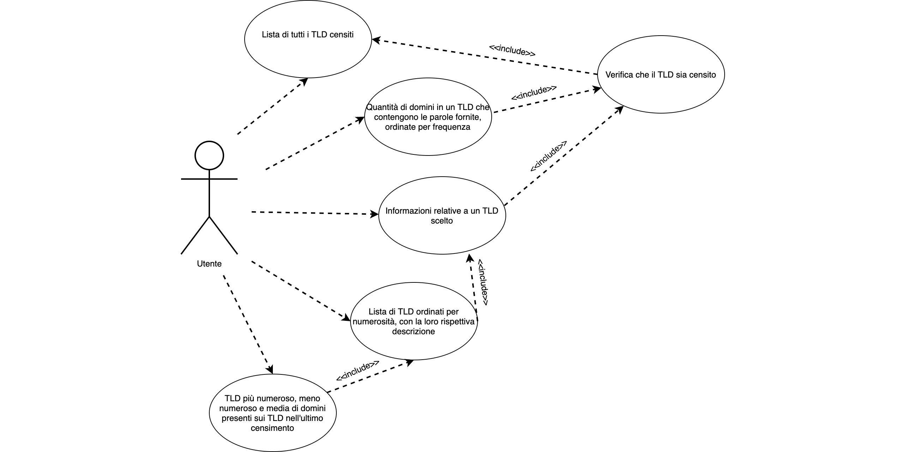
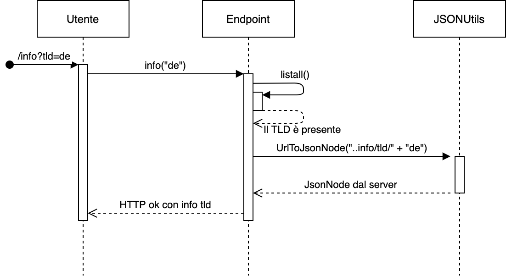
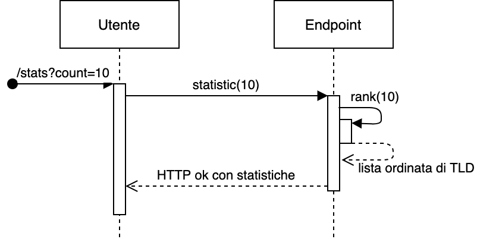
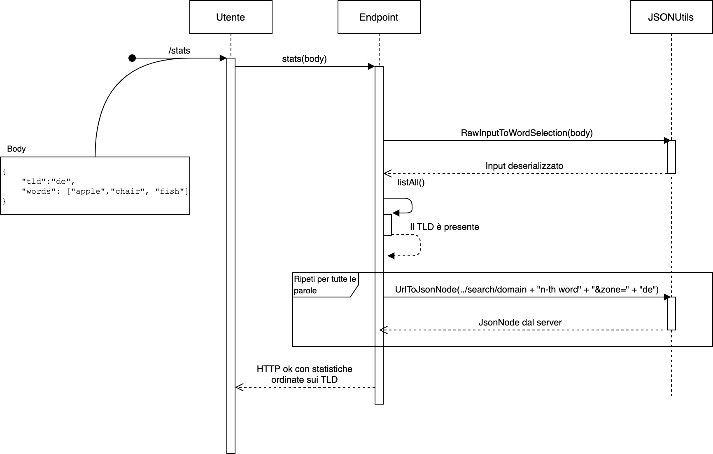

# EsamePO

Il nostro progetto implementa una API di tipo REST che permette di elaborare informazioni fornite dal servizio [Domains-Index](https://api.domainsdb.info/v1).

Link alle sezioni:

- [Funzionalità](#funzionalità)

- [Realizzazione](#realizzazione)

- [Eccezioni](#gestione-delle-eccezioni)

- [Test](#classi-di-test)

- [Documentazione](https://lbarontini.github.io/EsamePO)

## Funzionalità

In conformità allo stile REST, la nostra implementazione espone le seguenti funzionalità richiamabili tramite i metodi HTTP GET/POST.

### Diagramma dei casi d'uso



### Lista di tutti i TLD censiti

Richiesta GET sul percorso `/listAll`, senza alcun parametro.

```bash
$ curl -s 'http://localhost:8080/listAll' | jq
[
  {
    "name": "furniture"
  },
  {
    "name": "dclk"
  },
  {
    "name": "tennis"
  },
  {
    "name": "azure"
  },
  {
    "name": "swiftcover"
  },
  [...]
  {
    "name": "spreadbetting"
  }
]
```


### Informazioni relative a un TLD scelto

Richiesta GET sul percorso `/info` col parametro `tld` fornito dall'utente

```bash
$ curl -s 'http://localhost:8080/info?tld=de' | jq
{
  "name": "de",
  "includes": [
    "de"
  ],
  "description": [
    "de : https://en.wikipedia.org/wiki/.de",
    "Confirmed by registry <ops@denic.de> (with technical",
    "reservations) 2008-07-01"
  ]
}
```



### TLD più numeroso, meno numeroso e media di domini presenti sui TLD nell'ultimo censimento

Richiesta GET sul percorso `/stats` col parametro opzionale `count` che indica numero di TLD da prendere in considerazione per la statistica.
Se il parametro non viene fornito, il valore predefinito è 10.

```bash
$ curl -s 'http://localhost:8080/stats' | jq
{
  "min": {
    "name": "android",
    "domainsCount": 3,
    "description": [
      "android : 2014-08-07 Charleston Road Registry Inc."
    ]
  },
  "max": {
    "name": "gifts",
    "domainsCount": 5163,
    "description": [
      "gifts : 2014-07-03 Binky Moon, LLC"
    ]
  },
  "average": 1231.6
}
```



### Quantità di domini in un TLD che contengono le parole fornite, ordinate per frequenza

Richiesta POST sul percorso `/stats` inviando in formato JSON (MIME type `application/json`) il TLD scelto e un array contenente le parole da selezionare.

```bash
$ curl -s -H "Content-Type: application/json" -d '{"tld":"de","words": ["apple", "chair", "fish"]}' 'http://localhost:8080/stats' | jq
[
  {
    "name": "de",
    "matchesCount": 381,
    "matchingWord": "apple"
  },
  {
    "name": "de",
    "matchesCount": 175,
    "matchingWord": "fish"
  },
  {
    "name": "de",
    "matchesCount": 34,
    "matchingWord": "chair"
  }
]
```



### Lista di TLD ordinati per numerosità, con la loro rispettiva descrizione

Richiesta GET sul percorso `/rank` col parametro opzionale `count` che indica numero di TLD da prendere in considerazione per la statistica.
Se il parametro non viene fornito, il valore predefinito è 10.

```bash
$ curl -s 'http://localhost:8080/rank?count=4' | jq
[
  {
    "name": "furniture",
    "domainsCount": 3091,
    "description": [
      "furniture : 2014-03-20 Binky Moon, LLC"
    ]
  },
  {
    "name": "tennis",
    "domainsCount": 2228,
    "description": [
      "tennis : 2014-12-04 Binky Moon, LLC"
    ]
  },
  {
    "name": "azure",
    "domainsCount": 32,
    "description": [
      "azure : 2014-12-18 Microsoft Corporation"
    ]
  },
  {
    "name": "dclk",
    "domainsCount": 3,
    "description": [
      "dclk : 2014-11-20 Charleston Road Registry Inc."
    ]
  }
]
```


## Realizzazione

### Diagramma delle classi


Il progetto è realizzato tramite il framework Spring e in particolare di Spring Boot, che permette di creare uno scheletro partendo da una base convenzionale che include le dipendenze scelte (nel nostro caso un web server).

L'API _upstream_, Domains-Index, restituisce dati formattati in JSON, quindi abbiamo incluso la libreria Jackson nel file `pom.xml` come dipendenza.

Il progetto si serve del framework Spring Web, quindi abbiamo creato i package `controller` e `model` per rispettare la semantica.

Il package `controller` contiene la classe `Endpoint` che implementa le API REST nei vari metodi. L'output è "incapsulato" in un oggetto della classe `ResponseEntity`, in modo da poter settare il codice di uscita HTTP.

Il package `model` contiene varie classi che definiscono il formato della risposta. La classe principale è `TldName`, da cui ereditano `TldDescription` e `WordUsage`. Queste due sottoclassi implementano l'interfaccia Comparable che ci permette di riutilizzare i metodi della classe `Collections` al posto di metodi personalizzati, per operazioni come l'ordinamento e la ricerca del massimo e minimo. Similmente, la classe `TldName` effettua l'override del metodo equals, così da poter riutilizzare il metodo contains della classe `ArrayList`.

In uscita, il RestController effettua automaticamente la serializzazione della classe in JSON ma per migliorare la flessibilità abbiamo creato la classe `TldDescriptionSerializer` nel package `utils`, che produce un JSON diverso in base alle variabili di istanza popolate nell'oggetto della classe `TldDescription`.

Sempre nel package `utils`, abbiamo i deserializzatori `TldDescriptionDeserializer`, usato per trasformare il JSON restituito dall'API Domain-Index in un oggetto di tipo `TldDescription`, e `WordSelectionDeserializer`, per acquisire l'input dell'utente (sempre in JSON) inviato tramite metodo POST alla nostra applicazione. In entrambi i casi si effettua l'overriding del metodo deserialize di Jackson. Un'altra classe di questo package, `JSONUtils`, contiene alcuni metodi statici per effettuare operazioni tra JSON e Oggetti, creata principalente per ridurre la nidificazione dei costrutti try-catch nella classe `Endpoint`.

## Gestione delle eccezioni

La nostra implementazione, presente nel package `exception`, gestisce diverse eccezioni, fornendo all'utente una spiegazione dell'errore e la possibile soluzione.

Il nostro progetto crea due nuove eccezioni: `UserException` per le eccezioni da lanciare in caso di errore di input dell'utente, e `ServerException` da lanciare in caso di errore dovuto a malfunzionamenti dell'API di Domains-Index.

Inoltre, dirottiamo l'esecuzione in caso di `MethodArgumentTypeMismatchException`, in modo da mostrare un messaggio all'utente nel caso abbia fornito un parametro non intero (quando richiesto). Seguono le varie problematiche gestite:

- Problemi di comunicazione con Domains-Index
- TLD inesistente
- Dati forniti dall'utente nel formato errato
- Sruttura inaspettata del JSON restituita da Domains-Index
- JSON fornito dall'utente non conforme allo standard

## Classi di test

Le classi di test sono realizzate tramite i framework JUnit e Spring MVC. La classe `EsamepoApplicationTests` esegue una richiesta HTTP su tutti gli endpoint con parametri o body corretti, quindi verifica che la risposta rispecchi le aspettative.

La classe `EsamepoExceptionTests` esegue sempre le stesse richieste, ma questa volta con tutte le possibili combinazioni di parametri errati e verifica che le eccezioni vengano lanciate correttamente.
